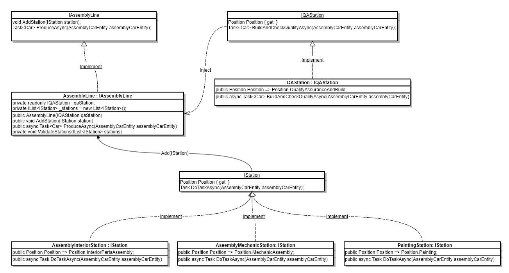

## Technologies

- .Net 5
- Xunit
- Moq


## How to run the project & tests

The project is developed by using .Net 5. The easiest way to run the project is to install [Dotnet 5](https://dotnet.microsoft.com/en-us/download/dotnet/5.0) and run the following command at the root directory of the project (beside IptiQ.Assignment.AssemblyLine.sln).

At the first, run the following command to restore required packages:

```powershell
dotnet restore
```

To run the project:

```powershell
dotnet run --project IptiQ.Assignment.AssemblyLine
```

To run tests:

```powershell
dotnet test
```


## How to Add the polish station

The IStation must be inherited by all stations except the quality assurance station. IStation has a Position property for determining the position in the assembly line, and a DoTaskAsync(AssemblyCarEntity) function to call the associated functions in  AssemblyCarEntity. 
PolistStation can be implemented by defining an enum in Position enums  to determine the position and calling the AssemblyCarEntity.Polish() function in the DoTaskAsync function. Then, call AssemblyLine.Add(IStation) to add it to the assembly line.

```C#
/// <summary>
///     Polish Station.
/// </summary>
public class PolishStation:IStation
{
    /// <summary>
    ///     The position in the assembly line.
    /// </summary>
    public Position Position => Position.Polish;
	
    /// <summary>
    ///     Do the station's tasks.
    /// </summary>
    public async Task DoTaskAsync(AssemblyCarEntity assemblyCarEntity)
    {
        assemblyCarEntity.Polish();
        await Task.CompletedTask;
    }
}
```


## Structure

<p align="center">
  
</p>

